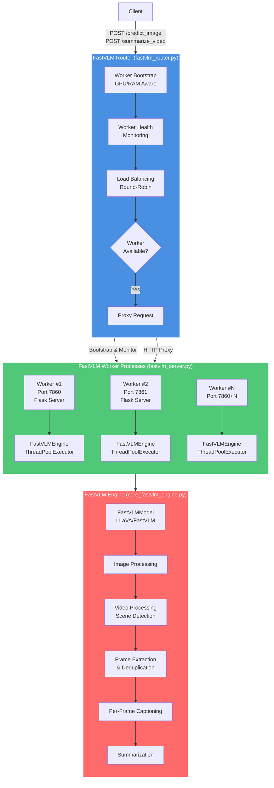
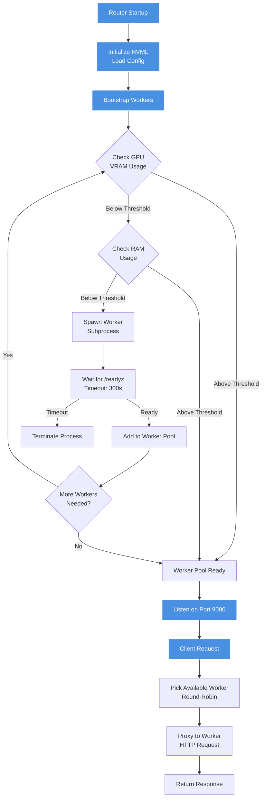
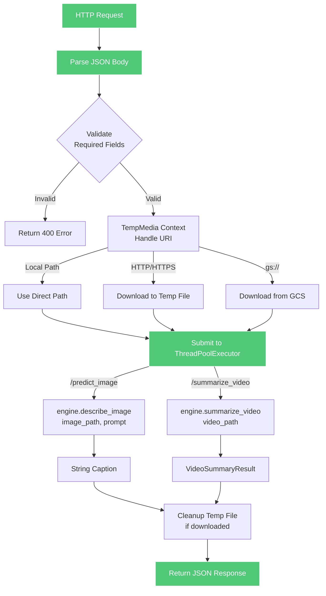
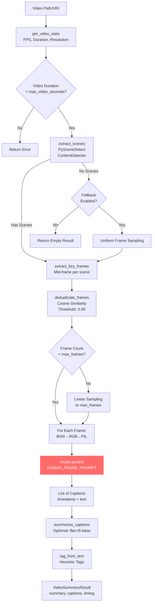

# 📦 **FastVLM AI Descriptor Engine**

**High-Performance Vision-Language Model Server for Image & Video Understanding**

> **📌 For standalone repository usage with centralized configuration system, see the [`refactor/config-centralization`](https://github.com/Pugsy-Explores/ml-fastvlm/tree/refactor/config-centralization) branch.**

---

## 🧭 Overview

The **FastVLM AI Descriptor Engine** is a high-throughput, multi-worker inference service that provides image and video understanding for downstream LLM pipelines.

It is built for:

* Social-media short-video analysis
* Creator engagement pipelines
* Comment classification
* Automated replies with creator tone
* Content understanding / metadata enrichment
* Faster LLM prompting with structured VLM context

The system is optimized for **GPU efficiency** and **parallel workload handling**.

---

## 🏗 Architecture (High Level)



### Component Responsibilities

**Router (`fastvlm_router.py`):**
- **Worker Bootstrap**: Spawns worker processes with GPU/RAM awareness (NVML + psutil)
- **Health Monitoring**: Tracks worker process health, removes dead workers
- **Load Balancing**: Round-robin selection of available workers
- **Request Proxying**: Forwards requests to workers, aggregates responses

**Worker Server (`fastvlm_server.py`):**
- **HTTP Interface**: Flask server exposing `/predict_image`, `/summarize_video`, `/healthz`, `/readyz`
- **Concurrent Execution**: ThreadPoolExecutor for parallel request handling
- **Media Management**: Uses `TempMedia` for local/HTTP/GS URI handling
- **Engine Wrapper**: Wraps `FastVLMEngine` calls with error handling

**Core Engine (`core_fastvlm_engine.py`):**
- **Model Wrapper**: `FastVLMModel` - loads and manages LLaVA/FastVLM model
- **Image Processing**: Direct image captioning via `describe_image()`
- **Video Pipeline**: Scene detection → frame extraction → deduplication → per-frame captioning → summarization
- **Stage Architecture**: Stage-0 (current) with hooks for Stage-1 (classification) and Stage-2 (tagging)

## 📋 Detailed Workflows

### Router Workflow (`fastvlm_router.py`)



**Key Router Functions:**
- `bootstrap_workers()`: Spawns workers until GPU/RAM thresholds reached
- `pick_available_worker()`: Round-robin selection of available workers
- `cleanup_dead_workers()`: Removes terminated workers from pool
- `proxy_post()` / `proxy_get()`: HTTP proxying to workers

### Server Workflow (`fastvlm_server.py`)



**Server Components:**
- **Flask App**: Single app instance per worker process
- **ThreadPoolExecutor**: Configurable via `FASTVLM_WORKERS` env var (default: 1)
- **TempMedia**: Context manager for local/HTTP/GS URI handling with automatic cleanup
- **Error Handling**: Structured error responses with appropriate HTTP status codes

### Engine Workflow (`core_fastvlm_engine.py`)

#### Image Processing Pipeline


#### Video Processing Pipeline



**Engine Key Classes:**
- **`FastVLMModel`**: Wraps LLaVA/FastVLM model loading and inference
  - Handles image input types: `str` (path), `PIL.Image`, `torch.Tensor`
  - 8-bit quantization via bitsandbytes (if available)
  - Configurable generation parameters (temperature, top_p, num_beams, max_new_tokens)
  
- **`FastVLMEngine`**: High-level orchestration
  - `describe_image()`: Single image captioning
  - `summarize_video()`: Full video pipeline with timing diagnostics
  - Stage hooks: `classify_content_type()`, `assign_tags()` (placeholders for future stages)

**Video Processing Details:**
- **Scene Detection**: PySceneDetect with ContentDetector (threshold: 30.0)
- **Frame Extraction**: Mid-frame per scene, downscaled to `max_resolution` (default: 1080px)
- **Deduplication**: Cosine similarity threshold 0.90, sequential comparison
- **Fallback Strategy**: Uniform sampling if scene detection fails (configurable)
- **Captioning**: Per-frame with `HUMAN_FRAME_PROMPT` (1-2 sentence descriptions)
- **Summarization**: Optional flan-t5-base or pegasus-xsum (fallback to join)


### Configuration System (`fastvlm_config.py`)

Configuration is loaded from TOML file with environment variable overrides:

**Config File**: `configs/fastvlm.toml` (or path from `FASTVLM_CONFIG_PATH`)

**Key Settings:**
- `model_path`: Path to FastVLM checkpoint directory (required)
- `device`: "cuda" or "cpu"
- `scene_threshold`: PySceneDetect threshold (default: 30.0)
- `frame_similarity_threshold`: Deduplication threshold (default: 0.90)
- `max_video_seconds`: Maximum video duration (default: 90.0)
- `max_resolution`: Frame downscale limit (default: 1080)
- `max_frames`: Maximum frames to process (default: 24)
- `max_context_chars`: Context truncation limit (default: 256)
- `enable_summary`: Enable summarization model (default: true)
- `enable_analysis`: Enable analyzer model (default: false)
- `log_level`: Logging level (default: "INFO")

**Environment Overrides:**
All settings can be overridden via environment variables (e.g., `FASTVLM_MODEL_PATH`, `FASTVLM_DEVICE`, etc.)

### Media Handling (`tmp_media.py`)

The `TempMedia` context manager handles multiple media source types:

- **Local Paths**: Direct file access (no download, no cleanup)
- **HTTP/HTTPS URLs**: Downloads via `requests` with streaming, size limits (default: 2 GiB)
- **GCS URIs (`gs://`)**: Downloads via `google-cloud-storage` library

**Features:**
- Automatic cleanup of downloaded files on context exit
- Size validation and limits (configurable via `FASTVLM_MAX_DOWNLOAD_SIZE_BYTES`)
- Timeout handling (configurable via `FASTVLM_DOWNLOAD_TIMEOUT_SECONDS`)
- Chunked streaming to avoid memory issues

---

## 🔬 Technical Implementation Details

### Model Architecture

**FastVLM Model (`FastVLMModel` class):**
- **Base Model**: LLaVA/FastVLM (LLaVA architecture with FastViT vision encoder)
- **Model Loading**: Uses `llava.model.builder.load_pretrained_model()`
- **Quantization**: 8-bit quantization via bitsandbytes (Linear8bitLt) for non-vision layers
  - Skipped modules: vision, clip, projector, lm_head, embed, norm
  - Falls back gracefully if bitsandbytes unavailable
- **Device Management**: Moves model to specified device (CUDA/CPU)
- **Generation Config**: Configures pad_token_id, eos_token_id from tokenizer

**Inference Process:**
1. **Image Preprocessing**: 
   - Load image (PIL/OpenCV) → Convert to RGB
   - Process via `process_images()` with model's image processor
   - Resize/normalize according to model config
   
2. **Prompt Construction**:
   - Add `IMAGE_TOKEN` (or `IM_START_TOKEN` + `IMAGE_TOKEN` + `IM_END_TOKEN`)
   - Build conversation template (default: "qwen_2")
   - Tokenize with `tokenizer_image_token()` (handles image token placement)

3. **Generation**:
   - Input IDs: `[batch_size, seq_len]` on device
   - Image tensor: `[batch_size, channels, height, width]` on device (float16)
   - Generation params: temperature=0.0 (deterministic), max_new_tokens=128
   - Uses `torch.inference_mode()` for efficiency

4. **Decoding**:
   - `tokenizer.batch_decode()` with `skip_special_tokens=True`
   - Strips whitespace from output

### Thread Safety & Concurrency

**Router Level:**
- Thread-safe worker pool with `threading.Lock()` for slot management
- Round-robin selection with atomic slot acquisition
- Dead worker cleanup before request routing

**Worker Level:**
- Flask app handles concurrent requests via WSGI server
- `ThreadPoolExecutor` processes requests in parallel (configurable workers)
- Each request gets isolated execution context

**Engine Level:**
- Model inference uses `torch.inference_mode()` (non-blocking, but not thread-safe for same model)
- ThreadPoolExecutor ensures sequential model access per worker
- GPU memory cleanup via `torch.cuda.empty_cache()` after video processing

### Memory Management

**GPU Memory:**
- Model loaded once per worker (shared across requests)
- Quantization reduces memory footprint (~50% for 8-bit)
- Frame tensors released after processing
- Explicit `torch.cuda.empty_cache()` after video summarization

**System Memory:**
- Video frames processed sequentially (not all in memory)
- TempMedia downloads use chunked streaming (1 MiB chunks)
- Automatic cleanup of temporary files
- Garbage collection after video processing

### Error Handling & Resilience

**Router:**
- Dead worker detection and removal
- Graceful degradation (continues with remaining workers)
- Structured error responses (503 with retry guidance)

**Server:**
- Try-except blocks around all endpoints
- Structured error responses with appropriate HTTP codes
- TempMedia cleanup in finally blocks
- ThreadPoolExecutor handles exceptions gracefully

**Engine:**
- Video validation (duration, file existence)
- Fallback strategies (uniform sampling if scene detection fails)
- Per-frame error handling (continues on individual frame failures)
- Returns empty but valid results on complete failure

---

## 🛠 **Current Features (v0.1.0)**

### **1. Multi-Worker FastVLM**

* Multiple worker processes per GPU host.
* Auto-spawned until VRAM & RAM thresholds reached.

### **2. VRAM + RAM Aware Worker Creation**

* Uses NVML + psutil.
* Prevents OOM and GPU thrashing.

### **3. Full Inference Pipelines**

#### `/predict_image`

* Single-image captioning via `FastVLMModel.predict()`
* Supports local paths, HTTP/HTTPS URLs, GCS URIs
* Fast inference path (typically < 2s on GPU)
* Configurable prompts
* Returns structured JSON with caption

#### `/summarize_video`

* **Video Analysis**:
  - Video stats extraction (FPS, duration, resolution)
  - Duration validation against `max_video_seconds`
  
* **Frame Processing**:
  - Scene detection via PySceneDetect (ContentDetector)
  - Keyframe extraction (mid-frame per scene)
  - Frame deduplication (cosine similarity threshold 0.90)
  - Fallback uniform sampling if scene detection fails
  - Frame count capping to `max_frames`
  
* **Captioning**:
  - Per-frame captioning with `HUMAN_FRAME_PROMPT`
  - Deterministic generation (temperature=0.0)
  - Timestamp tracking per caption
  
* **Post-Processing**:
  - Optional summarization (flan-t5-base or pegasus-xsum)
  - Heuristic tagging (visual_tags, vibe_tags, safety_flags)
  - Timing diagnostics for all stages
  
* **Response**:
  - `VideoSummaryResult` dataclass with all metadata
  - Structured JSON response with timing breakdown

### **4. Robust Testing Suite**

* Parallel stress test for image
* Parallel stress test for video
* Timing tests
* Error path coverage

### **5. Clean API**

* `/healthz`
* `/readyz`
* `/predict_image`
* `/summarize_video`

---

## 📁 File Structure & Dependencies

### Core Files

```
ml_fastvlm/
├── fastvlm_router.py          # Router service (worker management, load balancing)
├── fastvlm_server.py          # Worker HTTP server (Flask endpoints)
├── core_fastvlm_engine.py      # Core inference engine (model, video processing)
├── fastvlm_config.py           # Configuration loader (TOML + env overrides)
├── tmp_media.py                # Media downloader (local/HTTP/GCS)
├── prompts.py                  # Prompt templates (HUMAN_FRAME_PROMPT)
└── README.md                   # This file
```

### Key Dependencies

**Core:**
- `torch` - PyTorch for model inference
- `transformers` - Hugging Face transformers (for summarization models)
- `llava` - LLaVA/FastVLM model implementation
- `PIL` (Pillow) - Image processing
- `opencv-python` (cv2) - Video processing
- `scenedetect` - Scene detection library

**Router/Server:**
- `flask` - HTTP server framework
- `requests` - HTTP client for proxying
- `pynvml` - NVIDIA GPU memory monitoring
- `psutil` - System RAM monitoring

**Optional:**
- `bitsandbytes` - 8-bit quantization (falls back gracefully if missing)
- `google-cloud-storage` - GCS URI support (only if using gs://)

### Prompt System (`prompts.py`)

The system uses a single-frame human-readable prompt for Stage-0 captioning:

```python
HUMAN_FRAME_PROMPT = """
Describe this single frame in 1-2 short sentences. Mention the main objects, 
the primary action (if any), and a brief note about the surroundings/setting.

INPUT:
captions: "{CAPTIONS}"

OUTPUT (human readable):
<1-2 short sentences>
"""
```

The `{CAPTIONS}` placeholder is currently empty for Stage-0 but reserved for future context injection (e.g., OCR text, previous frame context).

---

## 📥 Model Setup

Before running the FastVLM Router, you need to download the model checkpoints and configure the model path.

### Step 1: Download Model Checkpoints

The FastVLM models are downloaded using the `get_models.sh` script. This script downloads all available model variants (0.5B, 1.5B, 7B) in both stage2 and stage3 configurations.

**From the FastVLM module directory:**

```bash
cd src/pugsy_ai/pipelines/vlm_pipeline/fastvlm/ml_fastvlm
chmod +x get_models.sh
./get_models.sh
```

**What this does:**
- Downloads all 6 model checkpoints (0.5B, 1.5B, 7B × stage2/stage3)
- Extracts them to `checkpoints/` directory
- Cleans up zip files after extraction

**Note**: This may take some time depending on your connection speed. The total download size is several GB.

**Expected directory structure after download:**
```
checkpoints/
├── llava-fastvithd_0.5b_stage2/
├── llava-fastvithd_0.5b_stage3/
├── llava-fastvithd_1.5b_stage2/
├── llava-fastvithd_1.5b_stage3/
├── llava-fastvithd_7b_stage2/
└── llava-fastvithd_7b_stage3/
```

### Step 2: Configure Model Path

The model path is configured in the FastVLM config file. The system looks for config in this order:

1. Path from `FASTVLM_CONFIG_PATH` environment variable
2. `fastvlm.toml` in current working directory
3. Falls back to defaults + environment overrides

**Config file location:** `configs/fastvlm.toml` (or path from `FASTVLM_CONFIG_PATH`)

**Example configuration:**
```toml
[fastvlm]
model_path = "/path/to/checkpoints/llava-fastvithd_0.5b_stage3"
device = "cuda"
scene_threshold = 30.0
frame_similarity_threshold = 0.90
max_video_seconds = 90.0
max_resolution = 1080
max_frames = 24
max_context_chars = 256
enable_summary = true
enable_analysis = false
log_level = "INFO"
```

**Update the `model_path` to match your setup:**

1. **Absolute path** (recommended):
   ```toml
   model_path = "/full/path/to/pugsy_ai/src/pugsy_ai/pipelines/vlm_pipeline/fastvlm/ml_fastvlm/checkpoints/llava-fastvithd_0.5b_stage3"
   ```

2. **Relative path** (from where config is loaded):
   ```toml
   model_path = "src/pugsy_ai/pipelines/vlm_pipeline/fastvlm/ml_fastvlm/checkpoints/llava-fastvithd_0.5b_stage3"
   ```

3. **Environment variable override**:
   ```bash
   export FASTVLM_MODEL_PATH="/path/to/checkpoint"
   ```

**Available model options:**
- `llava-fastvithd_0.5b_stage3` - Smallest, fastest (recommended for development)
- `llava-fastvithd_1.5b_stage3` - Balanced performance
- `llava-fastvithd_7b_stage3` - Largest, most accurate

**Note**: Stage3 models are recommended for inference. Stage2 models are intermediate training checkpoints.

**Configuration Priority:**
1. Environment variables (highest priority)
2. TOML file values
3. Default values (lowest priority)

### Step 3: Verify Model Setup

Verify that your model checkpoint exists and is accessible:

```bash
# Check if model directory exists
ls -la src/pugsy_ai/pipelines/vlm_pipeline/fastvlm/ml_fastvlm/checkpoints/llava-fastvithd_0.5b_stage3

# Verify key files are present (should include config.json, pytorch_model.bin, etc.)
ls src/pugsy_ai/pipelines/vlm_pipeline/fastvlm/ml_fastvlm/checkpoints/llava-fastvithd_0.5b_stage3/
```

**Expected files in checkpoint directory:**
- `config.json` - Model configuration
- `pytorch_model.bin` or `model.safetensors` - Model weights
- `tokenizer_config.json` - Tokenizer configuration
- Other model-specific files

### Troubleshooting Model Setup

**Model not found error:**
- Verify the path in `configs/fastvlm.toml` matches your actual checkpoint location
- Ensure you've run `./get_models.sh` and models are extracted
- Check that the checkpoint directory name matches exactly (case-sensitive)

**Download failed:**
- Check your internet connection
- Verify `wget` is installed: `which wget`
- Try downloading manually from the URLs in `get_models.sh`

**Wrong model path:**
- Use absolute paths to avoid path resolution issues
- Ensure the path points to the checkpoint directory (not the zip file)
- Verify the path is accessible from where you run the router

---

## 🚀 Running the FastVLM Router Service

The FastVLM Router is the main service that manages multiple worker processes and routes requests to available workers. It provides load balancing, concurrency control, and automatic worker management.

### Prerequisites

- Python 3.10+
- FastVLM model checkpoints downloaded (see Model Setup above)
- Required dependencies installed (`pynvml`, `psutil`, `flask`, `requests`)
- GPU with CUDA support (for GPU-based workers) or CPU fallback
- Model path configured in `configs/fastvlm.toml`

### Method 1: Using VS Code (Recommended for Development)

1. Open the project in VS Code
2. Go to Run and Debug (F5 or Cmd+Shift+D)
3. Select **"FastVLM Router"** from the dropdown
4. Press F5 to start debugging

The router will:
- Bootstrap worker processes automatically
- Start on `http://0.0.0.0:9000` (router port)
- Workers run on ports starting from `7860`

**Note**: The launch configuration is located at `.vscode/launch.json` in the project root.

### Method 2: Direct Python Execution

```bash
cd /Users/shang/my_work/pugsy_ai
PYTHONPATH=./src python -m pugsy_ai.pipelines.vlm_pipeline.fastvlm.ml_fastvlm.fastvlm_router
```

Or from the module directory:

```bash
cd src/pugsy_ai/pipelines/vlm_pipeline/fastvlm/ml_fastvlm
PYTHONPATH=../../../../.. python fastvlm_router.py
```

### Configuration (Environment Variables)

The router can be configured via environment variables:

| Variable | Default | Description |
|----------|---------|-------------|
| `FASTVLM_ROUTER_PORT` | `9000` | Port for the router service |
| `FASTVLM_BACKEND_BASE_PORT` | `7860` | Starting port for worker processes |
| `FASTVLM_GPU_INDEX` | `0` | GPU index to use |
| `FASTVLM_MAX_WORKERS` | `4` | Maximum number of workers to spawn |
| `FASTVLM_TARGET_VRAM_FRACTION` | `0.7` | Stop spawning workers when GPU memory reaches this fraction |
| `FASTVLM_TARGET_RAM_FRACTION` | `0.8` | Stop spawning workers when RAM reaches this fraction |
| `FASTVLM_MAX_CONCURRENT_PER_WORKER` | `2` | Maximum concurrent requests per worker |
| `FASTVLM_SERVER_MODULE` | `pugsy_ai.pipelines.vlm_pipeline.fastvlm.ml_fastvlm.fastvlm_server` | Python module path for worker server |
| `FASTVLM_PYTHON_BIN` | `python3` | Python executable to use for workers |
| `FASTVLM_LOG_LEVEL` | `INFO` | Logging level |

### Architecture

```
Router (Port 9000)
  ├── Worker 1 (Port 7860) - FastVLM Model Instance
  ├── Worker 2 (Port 7861) - FastVLM Model Instance
  ├── Worker 3 (Port 7862) - FastVLM Model Instance
  └── Worker 4 (Port 7863) - FastVLM Model Instance
```

The router:
- **Bootstraps workers** on startup (checks GPU/RAM before spawning)
- **Load balances** requests across available workers
- **Monitors worker health** via `/healthz` endpoint

### Testing the Router

Once running, test the endpoints:

**Health Check:**
```bash
curl http://localhost:9000/healthz
```

**Readiness Check:**
```bash
curl http://localhost:9000/readyz
```

**Image Prediction:**
```bash
curl -X POST "http://localhost:9000/predict_image" \
  -H "Content-Type: application/json" \
  -d '{
    "image_path": "/path/to/your/image.jpg",
    "prompt": "Describe the image."
  }'
```

**Video Summarization:**
```bash
curl -X POST "http://localhost:9000/summarize_video" \
  -H "Content-Type: application/json" \
  -d '{
    "video_path": "/path/to/your/video.mp4"
  }'
```

### Load Shedding & Retry Logic

When all workers are at max concurrency, the router returns:

```json
{
  "error": {
    "code": "workers_busy",
    "message": "All FastVLM workers are at max concurrency. Please retry after some time.",
    "retry_after_sec": 22.5
  }
}
```

**Client retry example:**
```python
import requests
import time

url = "http://localhost:9000/predict_image"
payload = {"image_path": "...", "prompt": "..."}
retry_attempt = 0

while True:
    resp = requests.post(url, json=payload, headers={"X-Retry-Attempt": str(retry_attempt)})
    if resp.status_code == 200:
        break
    elif resp.status_code == 503:
        data = resp.json()
        if data.get("error", {}).get("code") == "workers_busy":
            wait_time = data["error"].get("retry_after_sec", 5)
            time.sleep(wait_time)
            retry_attempt += 1
            continue
    # Handle other errors
    resp.raise_for_status()
```

### Troubleshooting

**No workers started:**
- Check GPU availability: `nvidia-smi`
- Verify `pynvml` is installed: `pip install pynvml`
- Check logs for worker spawn errors
- **Ensure model checkpoints are downloaded and configured** (see [Model Setup](#-model-setup) section above)
  - Verify `./get_models.sh` has been run successfully
  - Check that `configs/fastvlm.toml` has the correct `model_path`
  - Ensure the model path points to an existing checkpoint directory

**Port already in use:**
- Change router port: `FASTVLM_ROUTER_PORT=9001`
- Or change base worker port: `FASTVLM_BACKEND_BASE_PORT=7870`

**Workers not becoming ready:**
- Check worker logs (they run as subprocesses)
- Verify `FASTVLM_SERVER_MODULE` path is correct
- Ensure model path is accessible to worker processes
- Increase timeout: `CHECK_READY_TIMEOUT_SEC` (default: 300s)

**Import errors:**
- Ensure PYTHONPATH includes the project root
- Verify all dependencies are installed
- Check that `fastvlm_server` module can be imported

---

## 📡 API Endpoints

### Router Endpoints (Port 9000)

#### **GET /healthz**
Returns router and worker status.

**Response:**
```json
{
  "status": "ok",
  "workers": [
    {
      "port": 7860,
      "in_flight": 1,
      "max_concurrent": 2
    },
    {
      "port": 7861,
      "in_flight": 0,
      "max_concurrent": 2
    }
  ]
}
```

#### **GET /readyz**
Service readiness probe. Returns 200 if at least one worker is available, 503 otherwise.

**Response:**
```json
{
  "status": "ready",
  "workers": 2
}
```

#### **POST /predict_image**
Proxies to available worker. Returns 503 with `retry_after_sec` if all workers busy.

**Request:**
```json
{
  "image_path": "/path/to/image.jpg",
  "prompt": "Describe the image"
}
```

**Response (200):**
```json
{
  "image_path": "/path/to/image.jpg",
  "prompt": "Describe the image",
  "output": "A person standing in front of a building..."
}
```

**Response (503 - Workers Busy):**
```json
{
  "error": {
    "code": "workers_busy",
    "message": "All FastVLM workers are at max concurrency. Please retry after some time.",
    "retry_after_sec": 5.2
  }
}
```

#### **POST /summarize_video**
Proxies to available worker. Returns 503 with `retry_after_sec` if all workers busy.

**Request:**
```json
{
  "video_path": "/path/to/video.mp4"
}
```

**Response (200):**
```json
{
  "structured_available": false,
  "fastvlm": null,
  "diagnostics": {
    "stage": "stage0_text_only",
    "raw_captions_count": 5
  },
  "summary": "A short video showing a person cooking in a kitchen...",
  "visual_tags": [],
  "vibe_tags": [],
  "safety_flags": [],
  "scenes_detected": 3,
  "frames_used": 5,
  "captions": [
    {
      "timestamp_sec": 0.5,
      "caption": "A person is standing in a kitchen..."
    },
    {
      "timestamp_sec": 10.2,
      "caption": "The person is chopping vegetables..."
    }
  ],
  "timing": {
    "total_sec": 12.34,
    "scene_detection_sec": 1.2,
    "frame_processing_sec": 0.8,
    "captioning_sec": 9.5,
    "summary_sec": 0.84
  },
  "category": null,
  "tags": null
}
```

### Worker Endpoints (Ports 7860+)

Workers expose the same endpoints as the router, but are typically accessed only via router proxy. Direct access is possible for debugging.

**Supported Media Sources:**
- Local file paths: `/path/to/file.jpg`
- HTTP/HTTPS URLs: `https://example.com/image.jpg`
- GCS URIs: `gs://bucket-name/path/to/video.mp4`

---

## 🚦 Load Shedding & Concurrency Model

### Concurrency Control

Each worker maintains an in-flight request counter with a maximum limit (`MAX_CONCURRENT_PER_WORKER`, default: 2). The router uses a thread-safe slot acquisition system:

1. **Slot Acquisition**: `Worker.try_acquire_slot()` - atomically increments `in_flight` if below max
2. **Slot Release**: `Worker.release_slot()` - decrements `in_flight` (called in `finally` block)
3. **Worker Selection**: Round-robin through workers, skipping those at capacity

### Load Shedding

When all workers are at max concurrency, the router returns HTTP 503 with structured error:

```json
{
  "error": {
    "code": "workers_busy",
    "message": "All FastVLM workers are at max concurrency. Please retry after some time.",
    "retry_after_sec": 22.5
  }
}
```

**HTTP Headers:**
- `Retry-After: 22.5` (seconds)

### Adaptive Retry-After Computation

The `compute_retry_after()` function calculates delay based on:

1. **Endpoint Type**:
   - `/summarize_video`: Base 8.0s (heavier workload)
   - `/predict_image`: Base 1.0s (lighter workload)

2. **In-Flight Load**: 
   - Video: +10s per in-flight request
   - Image: +2s per in-flight request

3. **Retry Attempt** (from `X-Retry-Attempt` header):
   - Exponential growth: `2^retry_attempt`
   - Capped at 60s (video) or 10s (image)

**Formula:**
```
retry_after = base + (in_flight * per_load) + min(cap, 2^retry_attempt)
```

**Example:**
- Video endpoint, 2 in-flight requests, retry attempt 1:
  - `8.0 + (2 * 10.0) + min(60.0, 2^1) = 8.0 + 20.0 + 2.0 = 30.0s`

### Client Retry Strategy

Clients should:
1. Include `X-Retry-Attempt` header (0, 1, 2, ...)
2. Honor `retry_after_sec` from response
3. Use exponential backoff with jitter
4. Respect global timeout per request
5. Handle 503 separately from other errors

**Reference Implementation:**
```python
import requests
import time
import random

def predict_image_with_retry(url, payload, max_retries=5, timeout=300):
    retry_attempt = 0
    start_time = time.time()
    
    while retry_attempt < max_retries:
        if time.time() - start_time > timeout:
            raise TimeoutError("Request exceeded global timeout")
        
        headers = {"X-Retry-Attempt": str(retry_attempt)}
        resp = requests.post(url, json=payload, headers=headers, timeout=60)
        
        if resp.status_code == 200:
            return resp.json()
        elif resp.status_code == 503:
            data = resp.json()
            if data.get("error", {}).get("code") == "workers_busy":
                retry_after = data["error"].get("retry_after_sec", 5)
                # Add jitter (±20%)
                jitter = retry_after * 0.2 * (2 * random.random() - 1)
                wait_time = retry_after + jitter
                time.sleep(wait_time)
                retry_attempt += 1
                continue
        
        resp.raise_for_status()
    
    raise RuntimeError("Max retries exceeded")
```

---

## 🔧 Worker Bootstrap & Resource Management

### Bootstrap Process

1. **Initialize NVML**: GPU memory monitoring via `pynvml`
2. **Iterative Spawning**: For each worker (up to `MAX_WORKERS`):
   - Check GPU VRAM usage fraction
   - Check system RAM usage fraction
   - If either exceeds threshold (`TARGET_VRAM_FRACTION` or `TARGET_RAM_FRACTION`), stop spawning
   - Spawn worker subprocess via `subprocess.Popen`
   - Wait for `/readyz` endpoint (timeout: 300s)
   - Add to worker pool on success
3. **Worker Pool Initialization**: Create round-robin cycle iterator

### Resource Thresholds

- **GPU VRAM**: Default threshold 0.7 (70% used)
- **System RAM**: Default threshold 0.8 (80% used)
- **Max Workers**: Default 4 (configurable via `FASTVLM_MAX_WORKERS`)

### Worker Health Monitoring

- **Dead Worker Detection**: `cleanup_dead_workers()` checks `process.poll()`
- **Automatic Cleanup**: Dead workers removed from pool before request routing
- **Graceful Degradation**: System continues operating with remaining workers

### Process Management

- **Signal Handling**: SIGTERM/SIGINT trigger worker cleanup
- **Atexit Hooks**: Ensures workers terminated on Python exit
- **Graceful Termination**: 5s timeout for SIGTERM, then SIGKILL

---

## 🧪 Testing

Run:

```bash
python test_fastvlm_client.py
```

Includes:

* Unit tests
* Parallel image tests
* Parallel video tests
* End-to-end stress
* Retry-path draining
* Error-path validation

---

## 🚀 Quick Reference

### Starting the System

```bash
# Start router (auto-bootstraps workers)
PYTHONPATH=./src python -m pugsy_ai.pipelines.vlm_pipeline.fastvlm.ml_fastvlm.fastvlm_router
```

### Key Environment Variables

**Router:**
- `FASTVLM_ROUTER_PORT=9000` - Router HTTP port
- `FASTVLM_BACKEND_BASE_PORT=7860` - Starting port for workers
- `FASTVLM_GPU_INDEX=0` - GPU to use
- `FASTVLM_MAX_WORKERS=4` - Maximum workers to spawn
- `FASTVLM_TARGET_VRAM_FRACTION=0.7` - GPU memory threshold
- `FASTVLM_TARGET_RAM_FRACTION=0.8` - System RAM threshold
- `FASTVLM_MAX_CONCURRENT_PER_WORKER=2` - Concurrency per worker

**Engine:**
- `FASTVLM_MODEL_PATH` - Model checkpoint path (required)
- `FASTVLM_DEVICE=cuda` - Device (cuda/cpu)
- `FASTVLM_CONFIG_PATH` - Config file path
- `FASTVLM_LOG_LEVEL=INFO` - Logging level

**Worker Server:**
- `FASTVLM_PORT=7860` - Worker HTTP port (auto-assigned by router)
- `FASTVLM_WORKERS=1` - ThreadPoolExecutor workers

### Common Operations

**Check system status:**
```bash
curl http://localhost:9000/healthz
curl http://localhost:9000/readyz
```

**Process an image:**
```bash
curl -X POST http://localhost:9000/predict_image \
  -H "Content-Type: application/json" \
  -d '{"image_path": "/path/to/image.jpg", "prompt": "Describe this image"}'
```

**Process a video:**
```bash
curl -X POST http://localhost:9000/summarize_video \
  -H "Content-Type: application/json" \
  -d '{"video_path": "/path/to/video.mp4"}'
```

### Architecture Summary

1. **Router** (`fastvlm_router.py`): Manages worker pool, load balancing, concurrency control
2. **Worker Server** (`fastvlm_server.py`): HTTP endpoints, ThreadPoolExecutor, TempMedia handling
3. **Engine** (`core_fastvlm_engine.py`): Model inference, video processing, captioning pipeline

### Data Flow

```
Client Request
  → Router (port 9000)
    → Worker Selection (round-robin + slot check)
      → Worker Server (port 7860+)
        → ThreadPoolExecutor
          → FastVLMEngine
            → FastVLMModel (inference)
              → Response
                → Router
                  → Client
```

---

# 🔚 Conclusion

This README provides comprehensive documentation of the FastVLM AI Descriptor Engine:

* **Complete Architecture**: Router, Worker Server, and Core Engine workflows
* **Detailed Implementation**: Model loading, inference pipeline, video processing
* **API Documentation**: All endpoints with request/response examples
* **Configuration Guide**: TOML + environment variable system
* **Load Shedding Model**: Concurrency control and adaptive retry logic
* **Technical Details**: Memory management, thread safety, error handling
* **Quick Reference**: Common operations and environment variables

The system is production-ready with:
- Multi-worker GPU-aware deployment
- Robust error handling and resilience
- Comprehensive load shedding and retry semantics
- Clean API for integration
- Extensible architecture (Stage-0 with hooks for Stage-1/Stage-2)

Ready for integration into the larger creator-engagement platform (Seakrait + Pugsy AI).

