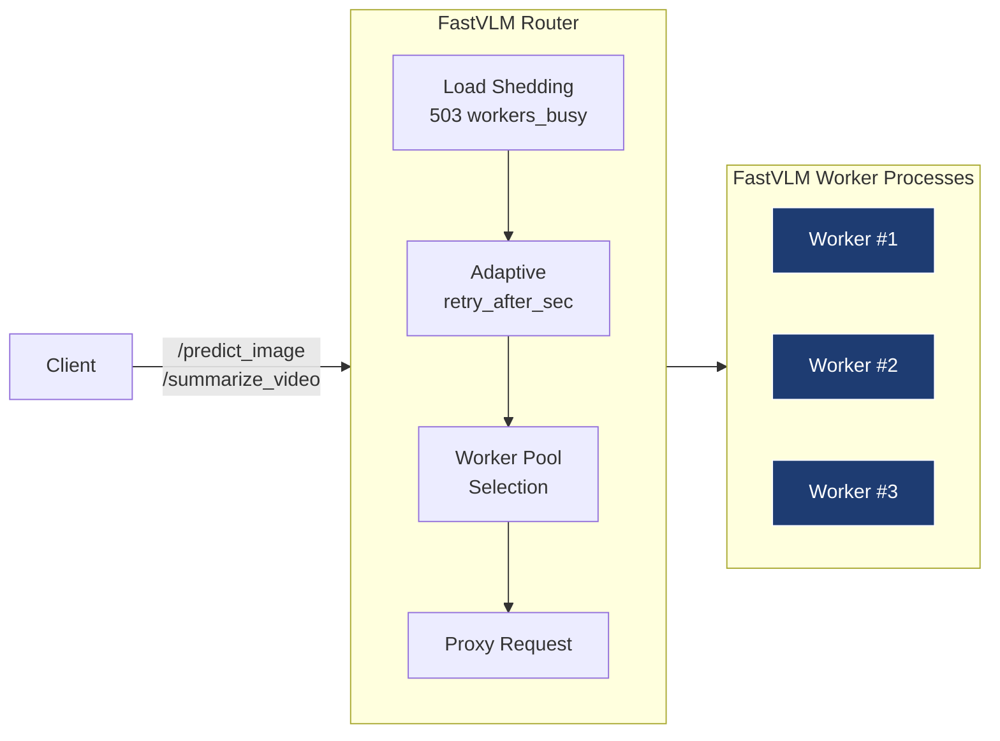
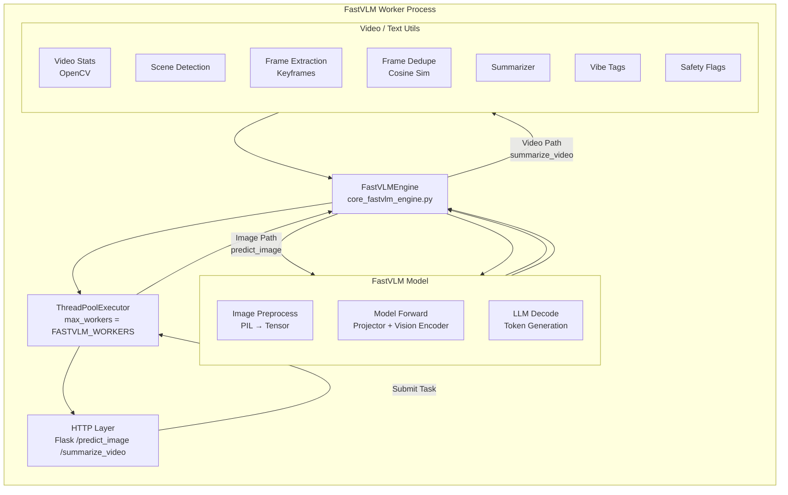

# 📦 **FastVLM AI Descriptor Engine**

**High-Performance Vision-Language Model Server for Image & Video Understanding**

---

## 🧭 Overview

The **FastVLM AI Descriptor Engine** is a high-throughput, multi-worker inference service that provides image and video understanding for downstream LLM pipelines.

It is built for:

* Social-media short-video analysis
* Creator engagement pipelines
* Comment classification
* Automated replies with creator tone
* Content understanding / metadata enrichment
* Faster LLM prompting with structured VLM context

The system is optimized for **GPU efficiency**, **parallel workload handling**, **adaptive load shedding**, and **predictable retry semantics**.

---

## 🏗 Architecture (High Level)



Each worker hosts:

* A full FastVLM model instance
* Video processing stack (scene detection, extraction, dedupe)
* Captioning + summary generation
* Safety/vibe tagging

## Worker Architecture — High-Level (Flowchart LR Style)


### Worker Image Pipeline (Flowchart LR)
```mermaid
flowchart LR

    subgraph Worker["FastVLM Worker - predict_image"]
        direction TB

        H[HTTP Layer /predict_image]
        EXEC[ThreadPoolExecutor]
        E[FastVLMEngine describe_image()]
        IMG[Load Image (PIL/OpenCV)]
        PRE[Preprocess (Tensorize)]
        MODEL[FastVLM Caption Generation]
        OUT[JSON Response]
    end

    H --> EXEC
    EXEC --> E
    E --> IMG
    IMG --> PRE
    PRE --> MODEL
    MODEL --> E
    E --> OUT
    OUT --> H

    classDef gpu fill:#1e3c72,stroke:#fff,color:#fff;
    class MODEL gpu;

```

### Worker Video Pipeline (Flowchart LR)
```mermaid
flowchart LR

    subgraph Worker["FastVLM Worker - summarize_video"]
        direction TB

        H[HTTP Layer\n/summarize_video]
        EXEC[ThreadPoolExecutor]
        E[FastVLMEngine\nsummarize_video()]

        subgraph VIDEO["Video Processing"]
            direction TB
            V1[Video Stats\nfps, duration]
            V2[Scene Detection]
            V3[Frame Extraction]
            V4[Frame Dedupe]
        end

        subgraph CAPTION["Frame Captioning"]
            direction TB
            C1[Convert to PIL]
            C2[Preprocess]
            C3[Model Caption]
        end

        SUM[Summarizer]
        TAGS[Safety / Vibe Tags]
        OUT[JSON Result]
    end

    H --> EXEC
    EXEC --> E

    %% video analysis
    E --> VIDEO
    VIDEO --> E

    %% per-frame captioning
    E --> C1
    C1 --> C2
    C2 --> C3
    C3 --> E

    %% summary
    E --> SUM
    SUM --> E

    %% tagging
    E --> TAGS
    TAGS --> E

    E --> OUT
    OUT --> H

    classDef gpu fill:#1e3c72,stroke:#fff,color:#fff;
    class C3 gpu;
```


Router is responsible for:

* Worker health
* In-flight concurrency limits
* Worker memory-aware spawning
* Load shedding + retry-after
* Proxying and result aggregation

---

## 🛠 **Current Features (v0.1.0)**

### **1. Multi-Worker FastVLM**

* Multiple worker processes per GPU host.
* Auto-spawned until VRAM & RAM thresholds reached.

### **2. VRAM + RAM Aware Worker Creation**

* Uses NVML + psutil.
* Prevents OOM and GPU thrashing.

### **3. Inflight Concurrency Control**

* Each worker has configurable `max_concurrent`.
* Router returns structured 503 when overloaded.

### **4. Adaptive Retry-After**

Router computes retry delay based on:

* Endpoint type (image/video)
* Total in-flight load
* Client retry attempt (`X-Retry-Attempt`)

### **5. Full Inference Pipelines**

#### `/predict_image`

* Single-image captioning
* Fast inference path

#### `/summarize_video`

* Scene detection
* Keyframe extraction
* Duplicate frame removal
* Per-frame captioning
* Multi-caption summarization
* Safety flags
* Vibe tags
* Timing block per stage

### **6. Robust Testing Suite**

* Parallel stress test for image
* Parallel stress test for video
* Timing tests
* Retry drain-down tests
* Error path coverage

### **7. Clean API**

* `/healthz`
* `/readyz`
* `/predict_image`
* `/summarize_video`

---

## 📥 Model Setup

Before running the FastVLM Router, you need to download the model checkpoints and configure the model path.

### Step 1: Download Model Checkpoints

The FastVLM models are downloaded using the `get_models.sh` script. This script downloads all available model variants (0.5B, 1.5B, 7B) in both stage2 and stage3 configurations.

**From the FastVLM module directory:**

```bash
cd src/pugsy_ai/pipelines/vlm_pipeline/fastvlm/ml_fastvlm
chmod +x get_models.sh
./get_models.sh
```

**What this does:**
- Downloads all 6 model checkpoints (0.5B, 1.5B, 7B × stage2/stage3)
- Extracts them to `checkpoints/` directory
- Cleans up zip files after extraction

**Note**: This may take some time depending on your connection speed. The total download size is several GB.

**Expected directory structure after download:**
```
checkpoints/
├── llava-fastvithd_0.5b_stage2/
├── llava-fastvithd_0.5b_stage3/
├── llava-fastvithd_1.5b_stage2/
├── llava-fastvithd_1.5b_stage3/
├── llava-fastvithd_7b_stage2/
└── llava-fastvithd_7b_stage3/
```

### Step 2: Configure Model Path

The model path is configured in the FastVLM config file. Update the path to point to your downloaded checkpoint:

**Config file location:** `configs/fastvlm.toml`

**Default configuration:**
```toml
[fastvlm]
model_path = "/home/shang/dev/src/pugsy_ai/pipelines/vlm_pipeline/fastvlm/ml_fastvlm/checkpoints/llava-fastvithd_0.5b_stage3"
device = "cuda"
```

**Update the `model_path` to match your setup:**

1. **Absolute path** (recommended):
   ```toml
   model_path = "/full/path/to/pugsy_ai/src/pugsy_ai/pipelines/vlm_pipeline/fastvlm/ml_fastvlm/checkpoints/llava-fastvithd_0.5b_stage3"
   ```

2. **Relative path** (from project root):
   ```toml
   model_path = "src/pugsy_ai/pipelines/vlm_pipeline/fastvlm/ml_fastvlm/checkpoints/llava-fastvithd_0.5b_stage3"
   ```

**Available model options:**
- `llava-fastvithd_0.5b_stage3` - Smallest, fastest (recommended for development)
- `llava-fastvithd_1.5b_stage3` - Balanced performance
- `llava-fastvithd_7b_stage3` - Largest, most accurate

**Note**: Stage3 models are recommended for inference. Stage2 models are intermediate training checkpoints.

### Step 3: Verify Model Setup

Verify that your model checkpoint exists and is accessible:

```bash
# Check if model directory exists
ls -la src/pugsy_ai/pipelines/vlm_pipeline/fastvlm/ml_fastvlm/checkpoints/llava-fastvithd_0.5b_stage3

# Verify key files are present (should include config.json, pytorch_model.bin, etc.)
ls src/pugsy_ai/pipelines/vlm_pipeline/fastvlm/ml_fastvlm/checkpoints/llava-fastvithd_0.5b_stage3/
```

**Expected files in checkpoint directory:**
- `config.json` - Model configuration
- `pytorch_model.bin` or `model.safetensors` - Model weights
- `tokenizer_config.json` - Tokenizer configuration
- Other model-specific files

### Troubleshooting Model Setup

**Model not found error:**
- Verify the path in `configs/fastvlm.toml` matches your actual checkpoint location
- Ensure you've run `./get_models.sh` and models are extracted
- Check that the checkpoint directory name matches exactly (case-sensitive)

**Download failed:**
- Check your internet connection
- Verify `wget` is installed: `which wget`
- Try downloading manually from the URLs in `get_models.sh`

**Wrong model path:**
- Use absolute paths to avoid path resolution issues
- Ensure the path points to the checkpoint directory (not the zip file)
- Verify the path is accessible from where you run the router

---

## 🚀 Running the FastVLM Router Service

The FastVLM Router is the main service that manages multiple worker processes and routes requests to available workers. It provides load balancing, concurrency control, and automatic worker management.

### Prerequisites

- Python 3.10+
- FastVLM model checkpoints downloaded (see Model Setup above)
- Required dependencies installed (`pynvml`, `psutil`, `flask`, `requests`)
- GPU with CUDA support (for GPU-based workers) or CPU fallback
- Model path configured in `configs/fastvlm.toml`

### Method 1: Using VS Code (Recommended for Development)

1. Open the project in VS Code
2. Go to Run and Debug (F5 or Cmd+Shift+D)
3. Select **"FastVLM Router"** from the dropdown
4. Press F5 to start debugging

The router will:
- Bootstrap worker processes automatically
- Start on `http://0.0.0.0:9000` (router port)
- Workers run on ports starting from `7860`

**Note**: The launch configuration is located at `.vscode/launch.json` in the project root.

### Method 2: Direct Python Execution

```bash
cd /Users/shang/my_work/pugsy_ai
PYTHONPATH=./src python -m pugsy_ai.pipelines.vlm_pipeline.fastvlm.ml_fastvlm.fastvlm_router
```

Or from the module directory:

```bash
cd src/pugsy_ai/pipelines/vlm_pipeline/fastvlm/ml_fastvlm
PYTHONPATH=../../../../.. python fastvlm_router.py
```

### Configuration (Environment Variables)

The router can be configured via environment variables:

| Variable | Default | Description |
|----------|---------|-------------|
| `FASTVLM_ROUTER_PORT` | `9000` | Port for the router service |
| `FASTVLM_BACKEND_BASE_PORT` | `7860` | Starting port for worker processes |
| `FASTVLM_GPU_INDEX` | `0` | GPU index to use |
| `FASTVLM_MAX_WORKERS` | `4` | Maximum number of workers to spawn |
| `FASTVLM_TARGET_VRAM_FRACTION` | `0.7` | Stop spawning workers when GPU memory reaches this fraction |
| `FASTVLM_TARGET_RAM_FRACTION` | `0.8` | Stop spawning workers when RAM reaches this fraction |
| `FASTVLM_MAX_CONCURRENT_PER_WORKER` | `2` | Maximum concurrent requests per worker |
| `FASTVLM_SERVER_MODULE` | `pugsy_ai.pipelines.vlm_pipeline.fastvlm.ml_fastvlm.fastvlm_server` | Python module path for worker server |
| `FASTVLM_PYTHON_BIN` | `python3` | Python executable to use for workers |
| `FASTVLM_LOG_LEVEL` | `INFO` | Logging level |

### Architecture

```
Router (Port 9000)
  ├── Worker 1 (Port 7860) - FastVLM Model Instance
  ├── Worker 2 (Port 7861) - FastVLM Model Instance
  ├── Worker 3 (Port 7862) - FastVLM Model Instance
  └── Worker 4 (Port 7863) - FastVLM Model Instance
```

The router:
- **Bootstraps workers** on startup (checks GPU/RAM before spawning)
- **Load balances** requests across available workers
- **Manages concurrency** (max requests per worker)
- **Returns 503** with `retry_after_sec` when all workers are busy
- **Monitors worker health** via `/healthz` endpoint

### Testing the Router

Once running, test the endpoints:

**Health Check:**
```bash
curl http://localhost:9000/healthz
```

**Readiness Check:**
```bash
curl http://localhost:9000/readyz
```

**Image Prediction:**
```bash
curl -X POST "http://localhost:9000/predict_image" \
  -H "Content-Type: application/json" \
  -d '{
    "image_path": "/path/to/your/image.jpg",
    "prompt": "Describe the image."
  }'
```

**Video Summarization:**
```bash
curl -X POST "http://localhost:9000/summarize_video" \
  -H "Content-Type: application/json" \
  -d '{
    "video_path": "/path/to/your/video.mp4"
  }'
```

### Load Shedding & Retry Logic

When all workers are at max concurrency, the router returns:

```json
{
  "error": {
    "code": "workers_busy",
    "message": "All FastVLM workers are at max concurrency. Please retry after some time.",
    "retry_after_sec": 22.5
  }
}
```

**Client retry example:**
```python
import requests
import time

url = "http://localhost:9000/predict_image"
payload = {"image_path": "...", "prompt": "..."}
retry_attempt = 0

while True:
    resp = requests.post(url, json=payload, headers={"X-Retry-Attempt": str(retry_attempt)})
    if resp.status_code == 200:
        break
    elif resp.status_code == 503:
        data = resp.json()
        if data.get("error", {}).get("code") == "workers_busy":
            wait_time = data["error"].get("retry_after_sec", 5)
            time.sleep(wait_time)
            retry_attempt += 1
            continue
    # Handle other errors
    resp.raise_for_status()
```

### Troubleshooting

**No workers started:**
- Check GPU availability: `nvidia-smi`
- Verify `pynvml` is installed: `pip install pynvml`
- Check logs for worker spawn errors
- **Ensure model checkpoints are downloaded and configured** (see [Model Setup](#-model-setup) section above)
  - Verify `./get_models.sh` has been run successfully
  - Check that `configs/fastvlm.toml` has the correct `model_path`
  - Ensure the model path points to an existing checkpoint directory

**Port already in use:**
- Change router port: `FASTVLM_ROUTER_PORT=9001`
- Or change base worker port: `FASTVLM_BACKEND_BASE_PORT=7870`

**Workers not becoming ready:**
- Check worker logs (they run as subprocesses)
- Verify `FASTVLM_SERVER_MODULE` path is correct
- Ensure model path is accessible to worker processes
- Increase timeout: `CHECK_READY_TIMEOUT_SEC` (default: 300s)

**Import errors:**
- Ensure PYTHONPATH includes the project root
- Verify all dependencies are installed
- Check that `fastvlm_server` module can be imported

---

## 📡 API Endpoints

### **GET /healthz**

Returns current worker status.

### **GET /readyz**

Service readiness probe.

### **POST /predict_image**

```json
{
  "image_path": "/path/to/image.jpg",
  "prompt": "Describe the image"
}
```

### **POST /summarize_video**

```json
{
  "video_path": "/path/to/video.mp4"
}
```

---

## 🚦 Load Shedding Model

When router cannot find any worker with free concurrency slots:

```json
{
  "error": {
    "code": "workers_busy",
    "retry_after_sec": 22.5,
    "message": "All FastVLM workers are at max concurrency"
  }
}
```

Workers never take more load than they can safely handle.

Clients must retry with **exponential backoff**. A reference implementation is included.

---

## 🔁 Retry Model

The recommended retry behavior is:

1. Exponential backoff
2. Honor `retry_after_sec` if provided
3. Cap delays (60s video, 8s image)
4. Respect a global per-request timeout

Client tests include the correct logic.

---

## 🧪 Testing

Run:

```bash
python test_fastvlm_client.py
```

Includes:

* Unit tests
* Parallel image tests
* Parallel video tests
* End-to-end stress
* Retry-path draining
* Error-path validation

---

# 🚀 **Future Release Roadmap (2-Day Iterations)**

Below is the production roadmap broken into fast, 1–2 day deliverables.

Each release is independent and cleanly scoped.

---

## 🟦 **Release v0.2 — Worker Reliability & Heartbeats**

**Time:** 1–2 days
**Goal:** Self-healing worker pool

### Features

* Worker → `/worker_health` heartbeat
* Router detects dead workers
* Auto-respawn worker processes
* Quarantine workers with repeated failures

**Outcome:** System stays alive even under crashes or GPU resets.

---

## 🟩 **Release v0.3 — Logging + Metrics (Prometheus)**

**Time:** 1–2 days
**Goal:** Full visibility

### Features

* JSON structured logging
* Per-worker and per-request logs
* `/metrics` exposing:

  * inflight
  * worker states
  * GPU usage
  * request_duration_seconds
  * busy_rejections_total

**Outcome:** Monitoring + alerting become possible immediately.

---

## 🟧 **Release v0.4 — Unified Error Schema + API Keys**

**Time:** 1–2 days
**Goal:** Clean, stable external API

### Features

* Standard JSON error schema
* API key middleware
* Optional IP allowlist
* Test coverage for errors

**Outcome:** Safe for client applications + cloud edge.

---

## 🟥 **Release v0.5 — Multi-GPU Support**

**Time:** 1–2 days
**Goal:** Scale vertically across GPUs

### Features

* Discover all GPUs
* Worker pools per GPU
* Least-loaded GPU routing
* Per-GPU metrics

**Outcome:** Throughput increases linearly across GPUs.

---

## 🟪 **Release v0.6 — Optional Job Queue Mode**

**Time:** 2 days
**Goal:** Handle extreme burst loads

### Features

* `mode = queue` in config
* Router quickly returns `job_id`
* Workers pull jobs
* `/job/<id>` endpoint
* TTL purging

**Outcome:** Smooths spikes without hammering retry loops.

---

## 🟫 **Release v0.7 — Distributed Tracing (OpenTelemetry)**

**Time:** 1–2 days
**Goal:** Deep introspection

### Features

* Trace IDs across router + worker
* Spans for:

  * scene detection
  * frame extraction
  * dedupe
  * captioning
  * summary
* Export to Jaeger

**Outcome:** You can now pinpoint slowdowns instantly.

---

## 🟨 **Release v0.8 — Horizontal Scaling (Multi-Host)**

**Time:** 2 days
**Goal:** Cluster deployment

### Features

* Remote worker registry
* Router load-balancing across hosts
* Host tagging capability
* Multi-host stress tests

**Outcome:** Can scale to a *farm* of FastVLM workers across machines.

---

# 🔚 Conclusion

This README documents:

* The **current capabilities**
* The **architecture**
* The **API**
* The **testing approach**
* And a **realistic, 2-week roadmap** covering future releases

This makes the service production-viable and ready for integration into the larger creator-engagement platform (Seakrait + Pugsy AI).

